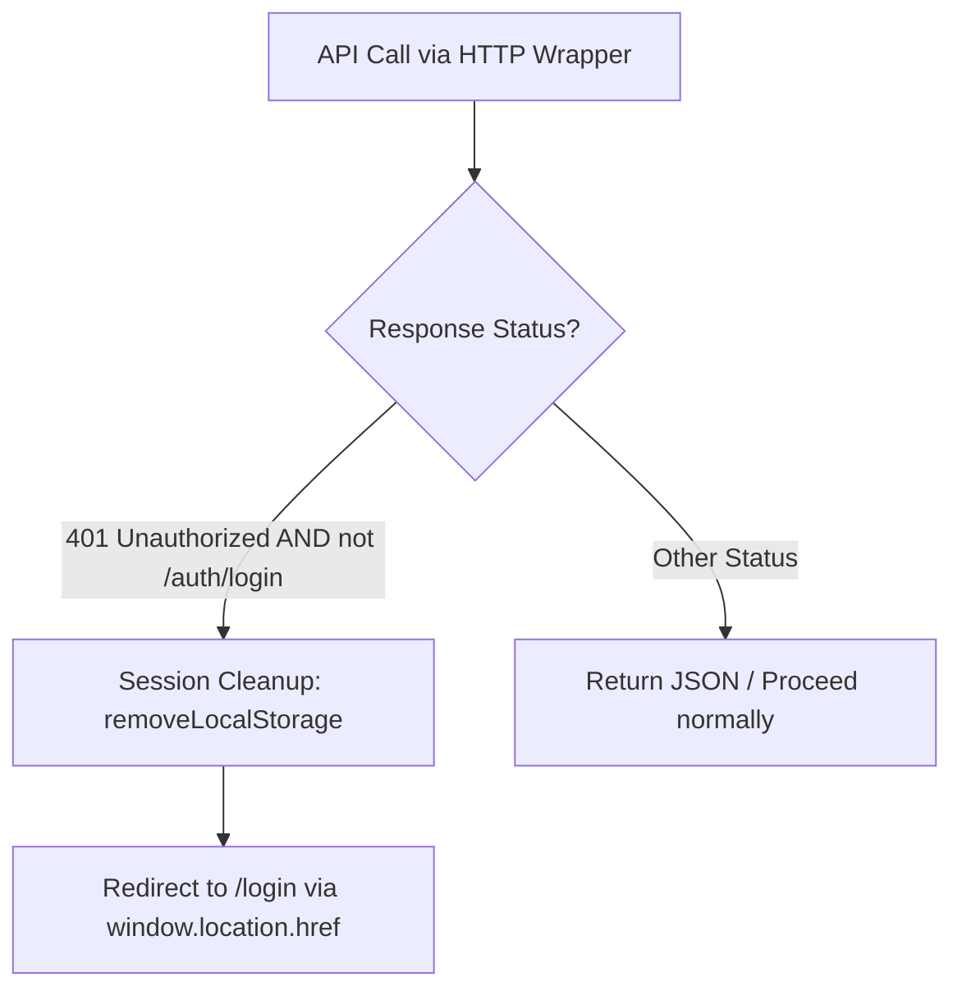
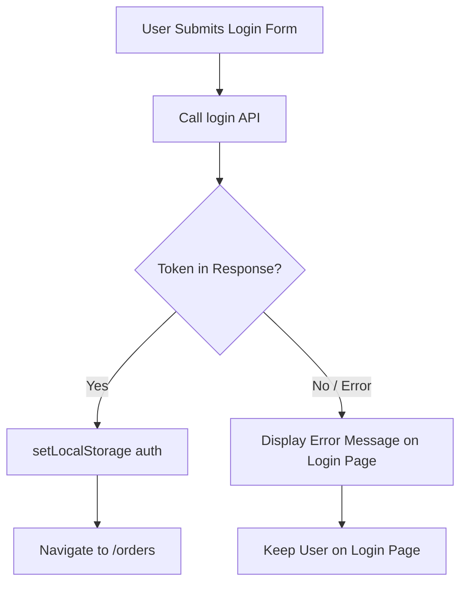

# Design Document: Auth Session Cleanup

## Current architecture impact

The change impacts the global network request layer (`src/utils/fetch.ts`) and the login page logic (`src/components/pages/Login/Login.tsx`). No new routing is required.

By intercepting `401 Unauthorized` responses in both `fetchAPI` and `fetcher` wrappers, we ensure that any failed authenticated API request triggered by SWR or manual service calls will trigger a session cleanup and redirect.

On the Login page, we will add verification to the login result. If the token is not returned, we will display an error message rather than writing an undefined/empty value to `localStorage` and incorrectly navigating the user to `/orders`.

## Component changes

### `src/utils/fetch.ts`

- Update `fetchAPI` and `fetcher` functions.
- Inspect `response.status` immediately after fetching.
- If `response.status === 401` and the URL does not include `/auth/login`:
  - Call `removeLocalStorage("auth")`.
  - Redirect using `window.location.href = "/login"`.
  - Return early or throw a specific error to halt further component execution.

### `src/components/pages/Login/Login.tsx`

- Maintain a local state `const [error, setError] = useState<string | null>(null)` to display credential errors.
- Inspect the returned `result` from the `login` service.
- If `result.token` is not present, or if `result.status` indicates a failure:
  - Set the error state with a friendly error message (e.g., "Invalid email or password").
  - Do not call `setLocalStorage("auth", ...)` and do not navigate.
- If `result.token` is present:
  - Clear any error state.
  - Store token and navigate to `/orders`.

## Data flow

## UI Layout Specification

On the Login page:
- If login fails, an error message block is rendered above the email field.
- The error message should be clearly visible (styled in red or warning colors using existing styling rules/tokens).

## Styling and Responsive Behavior

- Add a class like `.errorMessage` in `Login.module.css` using local CSS Modules.
- Use existing color tokens (e.g., a reddish tone for errors) if available, or a standard color.
- Make sure the error message fits the layout responsively.

## Technical Constraints

- Do not use React Router's `useNavigate` inside `src/utils/fetch.ts` because it is not a React component or hook. Use `window.location.href` for redirecting.
- Exclude the `/auth/login` endpoint from the 401 interception to prevent disrupting form validation.

## Verification Strategy

- **Manual Verification**:
  - Log in successfully, then manually modify the `"auth"` value in the browser's Local Storage to an invalid string. Refresh the page or click any action. The app should automatically clear the local storage and redirect to the `/login` route.
  - Attempt to log in with wrong credentials and verify that the app does not redirect and shows an error message.
- **Automated Verification**:
  - Run `npm run build` and `npm run lint` to ensure no TypeScript compilation or linting issues.
