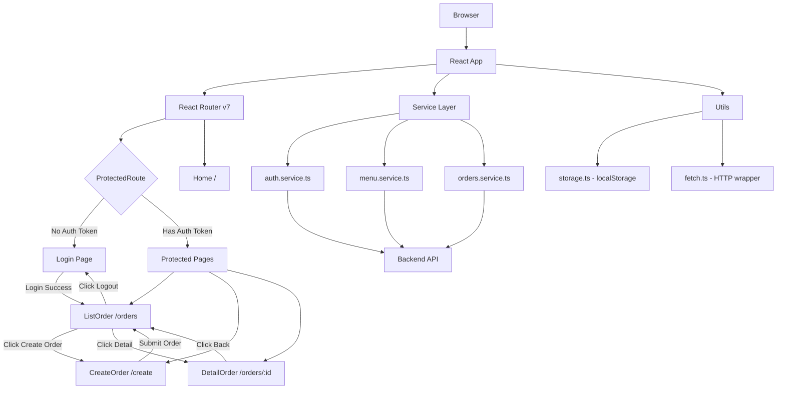

# Design Document: cafe-frontend-ui

## Overview

WPU Cafe adalah aplikasi frontend kasir berbasis React + TypeScript yang dibangun dengan Vite. Aplikasi ini memungkinkan staf cafe untuk login, melihat daftar order, membuat order baru, dan melihat detail order. Desain ini menggambarkan arsitektur yang sudah ada sekaligus mendefinisikan gap dan perbaikan yang perlu diimplementasikan agar semua requirement terpenuhi — terutama terkait error handling, validasi form, loading state, dan pengujian otomatis.

Aplikasi ini mengikuti pola **SPA (Single Page Application)** dengan React Router v7 untuk navigasi client-side, CSS Modules untuk scoped styling, dan JWT token di localStorage sebagai mekanisme autentikasi.

---

## Architecture

### Application Flow



### Layer Structure

```
src/
├── App.tsx                    # Root component, RouterProvider
├── main.tsx                   # React DOM render entry point
├── routes/
│   ├── index.tsx              # createBrowserRouter
│   ├── Route.tsx              # RouteObject definitions
│   └── ProtectedRoute.tsx     # Auth guard component
├── components/
│   ├── pages/                 # Page-level components
│   │   ├── Home/
│   │   ├── Login/
│   │   ├── ListOrder/
│   │   ├── CreateOrder/
│   │   └── DetailOrder/
│   └── ui/                    # Reusable UI primitives
│       ├── Button/
│       ├── Input/
│       └── Select/
├── services/                  # API layer (pure async functions)
│   ├── auth.service.ts
│   ├── menu.service.ts
│   └── orders.service.ts
├── types/                     # TypeScript interfaces
│   ├── auth.ts
│   └── order.ts
├── constants/
│   └── environment.ts         # VITE_API_URL
└── utils/
    ├── fetch.ts               # Wrapper atas native fetch
    └── storage.ts             # localStorage helpers
```

---

## Components and Interfaces

### UI Primitives

#### Button

```typescript
interface ButtonProps {
  type?: "button" | "submit" | "reset";
  children: string;
  onClick?: () => void;
  className?: string;
  color?: "primary" | "secondary";
  disabled?: boolean;              // diperlukan untuk loading state (Req 3.5)
  "aria-label"?: string;           // aksesibilitas (Req 7.6)
}
```

**Catatan desain:** Prop `disabled` perlu ditambahkan ke Button agar tombol "Completed" bisa dinonaktifkan saat request berlangsung (Requirement 3.5). Saat ini Button belum meng-handle prop ini secara eksplisit.

#### Input

```typescript
interface InputProps {
  label?: string;
  name: string;
  id: string;
  type?: string;
  placeholder?: string;
  required?: boolean;
  className?: string;
  value?: string;                  // controlled component support
  onChange?: (e: ChangeEvent<HTMLInputElement>) => void;
}
```

#### Select

```typescript
interface SelectOption {
  value: string;
  label: string;
}

interface SelectProps {
  label?: string;
  name: string;
  id: string;
  required?: boolean;
  className?: string;
  options: SelectOption[];
  value?: string;                  // controlled component support
  onChange?: (e: ChangeEvent<HTMLSelectElement>) => void;
}
```

### Page Components

#### ProtectedRoute

```typescript
interface ProtectedRouteProps {
  children: ReactNode;
}
// Logic:
// - getLocalStorage("auth") → truthy  → render children
// - getLocalStorage("auth") → falsy   → Navigate to /login
// - di /login dengan auth  → Navigate to /orders
```

#### Home

Tidak menerima props. Hanya menampilkan heading dan link ke `/login`.

#### Login

State yang dibutuhkan:
```typescript
{
  error: string | null;    // pesan error dari API (Req 2.4)
  isLoading: boolean;      // loading state selama request
}
```

#### ListOrder

State yang dibutuhkan:
```typescript
{
  orders: IOrder[];
  refetchOrder: boolean;
  isLoading: boolean;
  error: string | null;         // error fetch (Req 3.2)
  updateError: string | null;   // error update status (Req 3.6)
  loadingOrderId: string | null; // id order yang sedang diupdate (Req 3.5)
}
```

#### CreateOrder

State yang dibutuhkan:
```typescript
{
  menus: IMenu[];
  carts: ICart[];
  menuError: string | null;    // error fetch menu (Req 4.2)
  orderError: string | null;   // error submit order (Req 4.15)
  isSubmitting: boolean;       // loading saat submit
}
```

#### DetailOrder

State yang dibutuhkan:
```typescript
{
  order: IOrder | null;
  error: string | null;     // error fetch (Req 5.2)
  isLoading: boolean;
}
```

---

## Data Models

### Auth Token

```typescript
// Disimpan di localStorage dengan key "auth"
// Nilai: string JWT
// Contoh: "eyJhbGciOiJIUzI1NiJ9..."
type AuthToken = string;
```

### Menu Item

```typescript
interface IMenu {
  id: string;
  name: string;
  description: string;
  price: number;       // dalam satuan rupiah (IDR), tanpa desimal
  image_url: string;
  category: string;    // "Coffee" | "Non Coffee" | "Pastries" | "Desserts" | "Sandwiches"
  isAvailable: boolean;
}
```

### Cart Item

```typescript
interface ICart {
  menuId?: string;          // id dari IMenu
  quantity: number;         // minimal 1
  notes?: string;
  menuItem?: IMenu;         // populated dari API response pada detail order
  name?: string;            // nama item, digunakan saat cart belum populated
}
```

### Order

```typescript
interface IOrder {
  id: string;
  customer_name: string;
  table_number: number;   // 1-5
  cart: ICart[];
  status: "PENDING" | "PROCESSING" | "COMPLETED";
  total: number;          // total harga dalam rupiah
}
```

### API Request Payloads

```typescript
// POST /auth/login
interface ILogin {
  email: string;
  password: string;
}

// POST /orders
interface ICreateOrderPayload {
  customerName: string;
  tableNumber: number;
  cart: Array<{
    menuItemId: string;
    quantity: number;
    notes: string;
  }>;
}

// PUT /orders/:id
interface IUpdateOrderPayload {
  status: "COMPLETED";
}
```

### API Response Shapes

```typescript
// GET /menu
interface MenuListResponse {
  data: IMenu[];
}

// GET /orders
interface OrderListResponse {
  data: IOrder[];
}

// POST /auth/login
interface LoginResponse {
  token: string;
}
```

---

## Correctness Properties

*A property adalah karakteristik atau perilaku yang harus berlaku benar di semua eksekusi valid dari sebuah sistem — pada dasarnya, sebuah pernyataan formal tentang apa yang seharusnya dilakukan sistem. Properties berfungsi sebagai jembatan antara spesifikasi yang bisa dibaca manusia dan jaminan kebenaran yang dapat diverifikasi mesin.*

### Property 1: Submisi form login dengan kredensial valid selalu memanggil API

*For any* pasangan email non-kosong dan password non-kosong yang dimasukkan ke form Login, ketika tombol "Login" ditekan maka fungsi `login` dari `auth.service` harus dipanggil tepat satu kali dengan email dan password tersebut sebagai argumen.

**Validates: Requirements 2.2**

---

### Property 2: Token login tersimpan di localStorage

*For any* string token yang dikembalikan oleh API auth, setelah proses login berhasil token tersebut harus tersimpan di `localStorage["auth"]` dan nilainya harus sama persis dengan token yang dikembalikan API.

**Validates: Requirements 2.3**

---

### Property 3: Form kosong tidak mengirim request

*For any* kombinasi nilai yang salah satunya atau keduanya kosong/whitespace pada field email atau password, form Login tidak boleh memanggil API auth sama sekali.

**Validates: Requirements 2.5**

---

### Property 4: ProtectedRoute mengarahkan berdasarkan status token

*For any* nilai localStorage auth — jika nilai tersebut null/falsy maka ProtectedRoute harus merender `<Navigate to="/login" />`, dan jika nilainya adalah string non-kosong maka ProtectedRoute harus merender children yang diberikan.

**Validates: Requirements 2.6, 6.1, 6.2, 6.3**

---

### Property 5: Semua order dari API tampil sebagai baris tabel

*For any* array `IOrder[]` yang dikembalikan oleh mock API, ListOrder harus merender tepat sebanyak array tersebut baris tabel, dan setiap baris harus mengandung tombol "Detail" yang mengarah ke `/orders/${order.id}`.

**Validates: Requirements 3.1, 3.3**

---

### Property 6: Tombol "Completed" muncul hanya untuk order PROCESSING

*For any* array order yang berisi campuran status, hanya order dengan status `"PROCESSING"` yang boleh memiliki tombol "Completed" di barisnya. Order dengan status selain itu tidak boleh memiliki tombol tersebut.

**Validates: Requirements 3.4**

---

### Property 7: Semua menu item dari API tampil di daftar menu

*For any* array `IMenu[]` yang dikembalikan oleh mock API, CreateOrder harus merender setidaknya sejumlah item tersebut dalam daftar menu, dan setiap item harus menampilkan nama, gambar (via alt text), dan harga dalam format "Rp" dengan pemisah ribuan.

**Validates: Requirements 4.1, 4.6**

---

### Property 8: Pemilihan kategori memanggil API dengan parameter kategori yang benar

*For any* kategori yang dipilih dari daftar filter (selain "All"), CreateOrder harus memanggil `getMenus` dengan argumen kategori tersebut. Ketika "All" dipilih, `getMenus` harus dipanggil tanpa argumen kategori.

**Validates: Requirements 4.4, 4.5**

---

### Property 9: Cart increment/decrement mengubah quantity secara konsisten

*For any* `ICart[]` dan `IMenu` item yang sudah ada di cart, menekan "+" harus menambah quantity tepat 1. Menekan "-" pada item dengan quantity > 1 harus mengurangi quantity tepat 1. Menekan "-" pada item dengan quantity = 1 harus menghapus item tersebut dari cart.

**Validates: Requirements 4.7, 4.8, 4.9, 4.10**

---

### Property 10: Submisi order valid memanggil API dengan data yang benar

*For any* cart non-kosong dan data pelanggan yang valid (nama non-kosong, nomor meja valid), menekan tombol "Order" harus memanggil `createOrder` dengan payload yang berisi `customerName`, `tableNumber`, dan `cart` yang sesuai dengan state saat itu.

**Validates: Requirements 4.14**

---

### Property 11: Detail order menampilkan semua field order

*For any* objek `IOrder` yang dikembalikan mock API, DetailOrder harus merender semua field wajib: `id`, `customer_name`, `table_number`, `status`, dan `total`. Untuk setiap item di `cart`, harus merender nama item, quantity, dan subtotal (`price × quantity`).

**Validates: Requirements 5.1, 5.3, 5.4**

---

### Property 12: Button dengan warna berbeda memiliki class CSS yang berbeda

*For any* Button yang dirender dengan `color="primary"` dibandingkan dengan Button identik yang dirender dengan `color="secondary"`, keduanya harus memiliki perbedaan nilai `className` yang tercermin dari CSS Modules.

**Validates: Requirements 7.4**

---

## Error Handling

Semua halaman yang melakukan API call harus mengimplementasikan pola error handling berikut:

### Pola Error Handling

```typescript
// State
const [error, setError] = useState<string | null>(null);
const [isLoading, setIsLoading] = useState(false);

// Fetch dengan error handling
try {
  setIsLoading(true);
  setError(null);
  const result = await someService();
  // handle success
} catch (err) {
  const message = err instanceof Error ? err.message : "Terjadi kesalahan. Coba lagi.";
  setError(message);
} finally {
  setIsLoading(false);
}
```

### Error States per Halaman

| Halaman | Kondisi Error | Pesan yang Ditampilkan |
|---------|--------------|----------------------|
| Login | API gagal login | "Email atau password tidak valid." |
| ListOrder | API gagal fetch orders | "Data order tidak dapat dimuat. Coba refresh halaman." |
| ListOrder | API gagal update status | "Gagal memperbarui status order. Coba lagi." |
| CreateOrder | API gagal fetch menu | "Daftar menu tidak dapat dimuat. Coba refresh halaman." |
| CreateOrder | API gagal buat order | "Gagal membuat order. Coba lagi." |
| DetailOrder | API gagal fetch order | "Data order tidak ditemukan atau tidak dapat dimuat." |

### Loading State

- Tombol "Completed" harus dinonaktifkan (`disabled`) selama request update berlangsung, dan hanya tombol untuk `order.id` yang sedang diproses yang dinonaktifkan — tombol pada baris lain tetap aktif.
- Tombol "Order" di CreateOrder harus dinonaktifkan selama submit berlangsung.
- Tombol "Login" harus dinonaktifkan selama request autentikasi berlangsung.

### Validasi Form

Login form menggunakan HTML5 native validation (`required` attribute) yang sudah ada. Tidak perlu custom validation untuk requirement dasar ini — browser akan mencegah submit dan menampilkan pesan validasi bawaan.

CreateOrder form juga menggunakan `required` attribute pada field nama pelanggan. Tombol "Order" hanya ditampilkan ketika cart tidak kosong.

---

## Testing Strategy

### Stack Pengujian

Proyek ini belum memiliki test framework. Rekomendasi stack:

- **Test runner & unit tests**: [Vitest](https://vitest.dev/) — terintegrasi native dengan Vite, zero-config
- **React component testing**: [@testing-library/react](https://testing-library.com/docs/react-testing-library/intro/) + `@testing-library/user-event`
- **Property-based testing**: [fast-check](https://fast-check.io/) — library PBT untuk JavaScript/TypeScript yang mature
- **Browser environment simulation**: `jsdom` (sudah tersedia via Vitest)

```bash
npm install --save-dev vitest @testing-library/react @testing-library/user-event @testing-library/jest-dom fast-check jsdom
```

Tambahkan ke `vite.config.ts`:
```typescript
/// <reference types="vitest" />
export default defineConfig({
  test: {
    environment: "jsdom",
    globals: true,
    setupFiles: "./src/test/setup.ts",
  },
});
```

### Unit Tests (Example-Based)

Setiap page component harus memiliki unit test untuk skenario konkret berikut:

**Home:**
- Render: heading "Welcome To WPU Cafe" ada
- Render: tombol Login mengarah ke `/login`

**Login:**
- Render: form dengan field email, password, dan tombol submit ada
- Interaction: submit dengan kredensial valid memanggil `login` service
- Error state: pesan error tampil saat API gagal
- Redirect: saat login berhasil, navigasi ke `/orders`

**ListOrder:**
- Render: tabel dengan kolom yang benar tampil setelah data dimuat
- Interaction: klik "Completed" → update API dipanggil → tabel di-refresh
- Interaction: klik "Logout" → localStorage dibersihkan → navigasi ke `/login`
- Edge case: tombol "Completed" hanya tampil pada order PROCESSING

**CreateOrder:**
- Render: filter kategori tampil
- Interaction: klik filter → API dipanggil dengan kategori yang benar
- Interaction: cart kosong → pesan "Your cart is empty" tampil, tombol Order tidak ada
- Edge case: klik "-" pada quantity=1 → item dihapus dari cart

**DetailOrder:**
- Render: semua field order tampil
- Error state: pesan error tampil saat API gagal

### Property-Based Tests

Setiap property menggunakan Vitest + fast-check dengan minimum **100 iterasi**.

Setiap test harus diberi tag komentar dengan format:
```
// Feature: cafe-frontend-ui, Property N: <property text>
```

**Property 1 — Login form memanggil API dengan kredensial valid:**
```typescript
// fc.string({ minLength: 1 }) untuk email dan password
// assert: login service dipanggil dengan nilai yang dimasukkan
```

**Property 2 — Token tersimpan di localStorage:**
```typescript
// fc.string({ minLength: 1 }) untuk token
// assert: localStorage["auth"] === token setelah login sukses
```

**Property 3 — Form kosong tidak memanggil API:**
```typescript
// fc.oneof(fc.constant(""), fc.stringMatching(/^\s+$/)) untuk salah satu/kedua field
// assert: login service tidak pernah dipanggil
```

**Property 4 — ProtectedRoute routing berdasarkan token:**
```typescript
// fc.option(fc.string({ minLength: 1 })) untuk auth value (Some = logged in, None = not)
// assert: null → Navigate to /login; string → renders children
```

**Property 5 — Semua order tampil di tabel:**
```typescript
// fc.array(orderArb) untuk berbagai ukuran dan konten array order
// assert: jumlah baris tabel === array.length, setiap baris ada tombol Detail
```

**Property 6 — Tombol Completed hanya untuk PROCESSING:**
```typescript
// fc.array(orderArb) dengan berbagai status
// assert: hanya order.status === "PROCESSING" yang punya tombol Completed
```

**Property 7 — Semua menu item tampil dengan format benar:**
```typescript
// fc.array(menuArb) untuk berbagai daftar menu
// assert: setiap item ada image alt text, nama, dan harga format "Rp X.XXX"
```

**Property 8 — Filter kategori memanggil API dengan parameter benar:**
```typescript
// fc.constantFrom("Coffee", "Non Coffee", "Pastries", "Desserts", "Sandwiches")
// assert: getMenus dipanggil dengan kategori tersebut
```

**Property 9 — Cart state konsisten setelah increment/decrement:**
```typescript
// fc.array(cartItemArb) dan fc.nat({ max: 10 }) untuk quantity awal
// assert: setelah increment: quantity += 1; decrement qty>1: quantity -= 1; decrement qty=1: item removed
```

**Property 10 — Order payload sesuai state:**
```typescript
// fc.array(cartItemArb, { minLength: 1 }) dan customerArb
// assert: createOrder dipanggil dengan customerName, tableNumber, dan cart yang cocok dengan input
```

**Property 11 — Detail order menampilkan semua field:**
```typescript
// fc.record(orderArb) dengan cart yang bervariasi
// assert: semua field wajib ada di rendered output, subtotal = price * quantity
```

**Property 12 — Button warna berbeda menghasilkan className berbeda:**
```typescript
// Render dua Button: color="primary" vs color="secondary"
// assert: className primary !== className secondary
```

### Coverage Target

- Unit tests: branch coverage ≥ 80% pada semua page components
- Property tests: minimum 100 iterasi per property (konfigurasi `numRuns: 100` di fast-check)
- Happy path + error states harus tercakup di semua halaman

### Integrasi dengan CI

Tambahkan ke `package.json`:
```json
{
  "scripts": {
    "test": "vitest --run",
    "test:watch": "vitest"
  }
}
```
