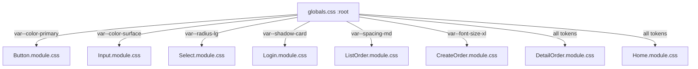
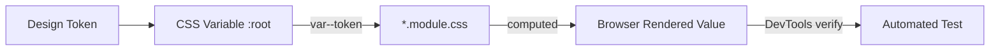

# Design Document: Cafe UI Styling

## Overview

Dokumen ini mendefinisikan arsitektur styling dan keputusan desain untuk peningkatan visual WPU Cafe. Pendekatan yang diambil adalah **design token system** berbasis CSS custom properties yang dideklarasikan di `src/styles/globals.css`, kemudian dikonsumsi oleh semua file `*.module.css`. Tidak ada perubahan pada logika komponen atau struktur TypeScript — semua perubahan terbatas pada file CSS.

Tujuan arsitektur ini:
- **Konsistensi**: satu sumber kebenaran untuk warna, spasi, radius, dan shadow
- **Maintainability**: mengubah satu token di `:root` langsung berefek ke seluruh aplikasi
- **Testability**: setiap token memiliki nilai konkret yang dapat diverifikasi secara programatik

---

## Architecture

### Styling Architecture

```
src/styles/globals.css
└── :root { ... }          ← Design token declarations (CSS custom properties)

src/components/ui/
├── Button/Button.module.css    ← konsumsi token via var()
├── Input/Input.module.css      ← konsumsi token via var()
└── Select/Select.module.css    ← konsumsi token via var()

src/components/pages/
├── Home/Home.module.css        ← konsumsi token via var()
├── Login/Login.module.css      ← konsumsi token via var()
├── ListOrder/ListOrder.module.css   ← konsumsi token via var()
├── CreateOrder/CreateOrder.module.css ← konsumsi token via var()
└── DetailOrder/DetailOrder.module.css ← konsumsi token via var()
```

### Constraint: Zero Hardcoded Values

Setiap deklarasi `color`, `background-color`, `border-color`, `border-radius`, `padding`, `gap`, `margin`, dan `box-shadow` di dalam file `*.module.css` wajib menggunakan `var(--token-name)`. Nilai literal yang diizinkan: `0`, `100%`, `auto`, `none`, `inherit`, `transparent`, lebar/gaya border (`1px solid`), dan `0.5` untuk opacity disabled.

### Tidak Ada Perubahan Struktur

- Tidak ada komponen baru yang dibuat
- Tidak ada perubahan pada file `.tsx`
- Tidak ada CSS-in-JS, utility class, atau framework styling baru
- Semua CSS class tetap menggunakan kebab-case sesuai konvensi yang ada

---

## Components and Interfaces

### globals.css — Design Token Declarations

Semua token dideklarasikan di selector `:root` pada `src/styles/globals.css`.


### Data Models

#### Design Token System

```css
:root {
  /* === Color Palette === */
  --color-primary: #1c1c1c;
  --color-text-primary: #1c1c1c;
  --color-bg-default: #ffffff;
  --color-surface: #ececec;
  --color-border: #1c1c1c;

  /* === Typography === */
  --font-size-base: 16px;
  --font-size-lg: 20px;
  --font-size-xl: 32px;
  --font-weight-bold: 700;

  /* === Spacing === */
  --spacing-xs: 4px;
  --spacing-sm: 8px;
  --spacing-md: 16px;
  --spacing-lg: 24px;
  --spacing-xl: 32px;

  /* === Border Radius === */
  --radius-sm: 8px;
  --radius-md: 16px;
  --radius-lg: 24px;

  /* === Shadow === */
  --shadow-card: 0px 0px 4px rgba(0, 0, 0, 0.1);
}
```

#### Token Rationale

| Token | Nilai | Alasan |
|---|---|---|
| `--color-primary` | `#1c1c1c` | Warna gelap dominan yang sudah digunakan di semua komponen existing |
| `--color-surface` | `#ececec` | Warna latar kartu/section yang sudah ada di DetailOrder dan CreateOrder |
| `--color-bg-default` | `#ffffff` | Background halaman putih bersih |
| `--font-size-xl` | `32px` | Dipakai di Login title dan Home h1; ratio ≥1.5x terhadap base (16px) |
| `--radius-lg` | `24px` | Radius kartu besar — sesuai nilai existing di CreateOrder dan DetailOrder |
| `--shadow-card` | `0px 0px 4px rgba(...)` | Shadow subtle yang sudah ada di CreateOrder form dan list item |

---


## Component Design Decisions

### Button (`Button.module.css`)

**Current state**: Menggunakan hardcoded `#1c1c1c`, `#fff`, `0.5rem` untuk radius.

**Changes**:
- `.button`: ganti `border-radius: 0.5rem` → `var(--radius-sm)`, tambah `transition`
- `.button-primary`: ganti semua hex values → tokens
- `.button-secondary`: ganti semua hex values → tokens
- Tambah selector interaktif: `:hover:not([disabled])`, `:focus-visible`, `:disabled`

**Design decisions**:
- Hover effect: `opacity: 0.85` — lebih sederhana dan konsisten dibanding mengubah warna latar
- Focus visible: `outline: 2px solid var(--color-primary); outline-offset: 2px` — mengesampingkan `outline: none` di globals.css
- Disabled: `opacity: 0.5; cursor: not-allowed` + blok hover dengan `:hover:not([disabled])`
- Transition: `opacity 150ms ease-in-out, background-color 150ms ease-in-out`

```css
/* Contoh target state */
.button {
  padding: var(--spacing-sm) var(--spacing-md);
  border-radius: var(--radius-sm);
  font-weight: var(--font-weight-bold);
  display: flex; justify-content: center; align-items: center;
  transition: opacity 150ms ease-in-out, background-color 150ms ease-in-out;
}
.button-primary {
  background-color: var(--color-primary);
  color: var(--color-bg-default);
  border: 1px solid var(--color-primary);
}
.button-secondary {
  background-color: var(--color-bg-default);
  color: var(--color-primary);
  border: 1px solid var(--color-border);
}
.button:hover:not([disabled]) { opacity: 0.85; }
.button:focus-visible { outline: 2px solid var(--color-primary); outline-offset: 2px; }
.button:disabled, .button[disabled] { opacity: 0.5; cursor: not-allowed; }
```

---

### Input (`Input.module.css`)

**Current state**: Hardcoded `8px` gap, `bold`, `12px 16px` padding, `8px` radius, `#1c1c1c` border.

**Changes**:
- `.label`: ganti `gap: 8px` → `var(--spacing-sm)`, ganti `font-weight: bold` → `var(--font-weight-bold)`, tambah `font-size: var(--font-size-base)`
- `.input`: ganti semua hardcoded → tokens, tambah focus state, placeholder, disabled, transition

```css
/* Contoh target state */
.label {
  display: flex; flex-direction: column;
  gap: var(--spacing-sm);
  font-size: var(--font-size-base);
  font-weight: var(--font-weight-bold);
}
.input {
  padding: var(--spacing-sm) var(--spacing-md);
  border-radius: var(--radius-sm);
  border: 1px solid var(--color-border);
  transition: border-color 150ms ease-in-out, box-shadow 150ms ease-in-out;
}
.input:focus {
  border-color: var(--color-primary);
  box-shadow: 0 0 0 3px rgba(28, 28, 28, 0.15);
  outline: none;
}
.input::placeholder { opacity: 0.5; }
.input:disabled { background-color: var(--color-surface); cursor: not-allowed; }
```

---

### Select (`Select.module.css`)

**Current state**: Hardcoded values, `appearance: none` sudah ada tapi tanpa ikon kustom.

**Consistency constraint**: Semua nilai `.select` untuk padding, border, border-radius, font-size, font-family **harus identik** dengan `.input` di Input.module.css — keduanya menggunakan token yang sama.

**Custom arrow icon**: Implementasi via `background-image` dengan SVG data URI di `.select`. Ini mempertahankan seluruh area elemen sebagai clickable target (tidak ada pseudo-element yang menghalangi).

```css
/* Contoh target state */
.select {
  padding: var(--spacing-sm) var(--spacing-md);
  border-radius: var(--radius-sm);
  border: 1px solid var(--color-border);
  font-size: var(--font-size-base);
  font-family: inherit;
  appearance: none;
  background-image: url("data:image/svg+xml,..."); /* SVG panah kustom */
  background-repeat: no-repeat;
  background-position: right var(--spacing-sm) center;
  padding-right: var(--spacing-xl); /* ruang untuk ikon */
  transition: border-color 150ms ease-in-out, box-shadow 150ms ease-in-out;
}
.select:focus {
  border-color: var(--color-primary);
  box-shadow: 0 0 0 3px rgba(28, 28, 28, 0.15);
  outline: none;
}
.select:disabled { opacity: 0.5; cursor: not-allowed; }
```

---


### Home Page (`Home.module.css`)

**Current state**: `gap: 8px` hardcoded, `height: 100vh` (bukan `min-height`). Komponen `.tsx` hanya merender `<h1>` dan tombol Login — tidak ada paragraf deskripsi.

**Changes**:
- `.home`: ganti `height` → `min-height: 100vh`, ganti `gap: 8px` → `var(--spacing-sm)`, tambah media query untuk ≤600px, tambah `padding: var(--spacing-md)` di media query
- Tambah selector untuk `h1`: `font-size: var(--font-size-xl)`
- **Komponen `.tsx` perlu dimodifikasi**: tambah elemen `<p>` deskripsi antara `<h1>` dan tombol Login (AC 5.3)

**Catatan tentang perubahan TSX**: Ini adalah satu-satunya halaman di mana file `.tsx` perlu diubah — untuk menambah elemen teks deskripsi. Perubahan ini minimal dan tidak mengubah logika.

---

### Login Page (`Login.module.css`)

**Current state**: Hardcoded `box-shadow`, `padding: 32px`, `border-radius: 20px`, `font-size: 32px`, `gap: 24px`.

**Changes**: Semua nilai hardcoded diganti dengan token. `max-width: 400px` ditambahkan ke `.card` untuk viewport besar.

```css
/* Contoh target state */
.card {
  border-radius: var(--radius-lg);
  box-shadow: var(--shadow-card);
  padding: var(--spacing-xl);
  width: 30%;
  max-width: 400px;
}
@media screen and (max-width: 768px) { .card { width: 100%; } }
.title { font-size: var(--font-size-xl); font-weight: var(--font-weight-bold); text-align: center; }
.form { display: flex; flex-direction: column; gap: var(--spacing-md); }
```

---

### ListOrder Page (`ListOrder.module.css`)

**Current state**: Tidak ada thead styling, tidak ada hover state untuk baris, tidak ada Status Badge, tidak ada overflow wrapper.

**New additions**:
1. **Thead styling**: `background-color: var(--color-primary); color: var(--color-bg-default)`
2. **Tbody hover**: `tbody tr:hover { background-color: var(--color-surface); }`
3. **Status Badge**: dua kelas baru `.badge`, `.badge-processing`, `.badge-completed`
4. **Table wrapper**: elemen `<div>` wrapper dengan `overflow-x: auto`
5. **Header gap**: ganti `gap: 20px` → `var(--spacing-lg)` untuk `.button`
6. **Spacing**: ganti `margin-bottom: 20px` → `var(--spacing-lg)`

**Status Badge color design**:
- `.badge-processing`: `background-color: #f59e0b` (amber, HSL ~45) — warna tidak bisa dari token karena tidak ada token warna status. **Exception**: warna status badge adalah satu-satunya nilai warna yang boleh hardcoded karena tidak termasuk dalam lima token warna yang didefinisikan di Requirement 1. Namun jika memungkinkan, tambahkan token `--color-status-processing` dan `--color-status-completed` ke `:root`.
- `.badge-completed`: `background-color: #22c55e` (green, HSL ~142)

**Keputusan desain**: Tambahkan token `--color-status-processing` dan `--color-status-completed` ke `:root` di globals.css untuk mempertahankan konsistensi zero hardcoded values.

**Implementasi Status Badge di JSX**: Komponen `ListOrder.tsx` perlu dimodifikasi untuk merender `<span className={getStatusBadgeClass(order.status)}>{order.status}</span>` alih-alih teks biasa. Logika `getStatusBadgeClass` memilih kelas berdasarkan nilai status.

---

### CreateOrder Page (`CreateOrder.module.css`)

**Current state**: Banyak hardcoded values — `#f7f7f7`, `rgba(0,0,0,0.1)`, `24px` radius, `px` values untuk gap/padding.

**Changes**:
- `.list .item`: ganti `box-shadow` → `var(--shadow-card)`, `border-radius: 24px` → `var(--radius-lg)`, `padding: 16px` → `var(--spacing-md)`, tambah `:hover` dengan transition
- `.form`: ganti `box-shadow` → `var(--shadow-card)`, `border-radius: 24px` → `var(--radius-lg)`, `padding: 16px` → `var(--spacing-md)`
- `.form .input, .form .cart`: ganti `background-color: #f7f7f7` → `var(--color-surface)`, `border-radius: 16px` → `var(--radius-md)`, `gap: 16px` → `var(--spacing-md)`, `padding: 16px` → `var(--spacing-md)`
- Tambah kelas `.empty-cart` untuk teks "Your cart is empty"
- Tambah media query untuk grid: `≤768px → grid-template-columns: 1fr`

**Hover effect untuk kartu menu**:
```css
.list .item:hover {
  box-shadow: 0 8px 24px rgba(0, 0, 0, 0.12);
  transform: translateY(-4px);
  transition: box-shadow 150ms ease-in-out, transform 150ms ease-in-out;
}
```

---

### DetailOrder Page (`DetailOrder.module.css`)

**Current state**: Hardcoded `#ececec`, `20px` padding/border-radius/gap di beberapa tempat, `24px` font-size.

**Changes**:
- `.info`: ganti `background-color: #ececec` → `var(--color-surface)`, `border-radius: 20px` → `var(--radius-lg)`, `padding: 20px` → `var(--spacing-md)`, `gap: 20px` → `var(--spacing-md)`
- `.list`: ganti `gap: 16px` → `var(--spacing-md)`
- `.list .item`: ganti `background-color: #ececec` → `var(--color-surface)`, `border-radius: 20px` → `var(--radius-lg)`, `padding: 16px` → `var(--spacing-md)`, `gap: 20px` → `var(--spacing-md)`
- `.name, .price`: ganti `font-size: 24px` → `var(--font-size-lg)` (20px, lebih proporsional untuk card item)
- Tambah tiga media query responsif untuk `.list`
- Tambah selector `.error` untuk error state
- Ganti `margin-bottom: 20px` dan `margin-top: 20px` → `var(--spacing-md)` atau `var(--spacing-lg)`

**Responsive breakpoints untuk `.list`**:
```css
@media screen and (max-width: 768px) { .list { grid-template-columns: 1fr; } }
@media screen and (min-width: 769px) and (max-width: 1024px) { .list { grid-template-columns: repeat(2, 1fr); } }
@media screen and (min-width: 1025px) { .list { grid-template-columns: repeat(3, 1fr); } }
```

**Status Badge**: Komponen `DetailOrder.tsx` menggunakan nama kelas CSS yang **identik** dengan `ListOrder.tsx` untuk Status Badge. Karena kedua komponen menggunakan file `.module.css` yang berbeda, kelas yang digunakan adalah kelas yang di-import dari masing-masing file modul — nama kelas lokal harus sama (misalnya `.badge`, `.badge-processing`, `.badge-completed`).

**Error state**: Komponen `DetailOrder.tsx` perlu dimodifikasi untuk menangani error fetch dan merender elemen error.

---


## Responsive Breakpoints

| Breakpoint | Nilai | Digunakan di |
|---|---|---|
| Mobile | `≤ 600px` | Home (padding) |
| Tablet | `≤ 768px` | Login (card width), CreateOrder (layout direction, grid), DetailOrder (grid 1fr) |
| Tablet–Desktop | `769px–1024px` | DetailOrder (grid 2fr) |
| Desktop | `≥ 768px` | CreateOrder (flex row, menu 70%) |
| Large Desktop | `≥ 1025px` | DetailOrder (grid 3fr) |

Semua breakpoint dideklarasikan sebagai `@media screen` queries langsung di dalam file `*.module.css` masing-masing (bukan di globals.css). Ini mempertahankan lokalitas styling.

---

## Correctness Properties

*A property is a characteristic or behavior that should hold true across all valid executions of a system — essentially, a formal statement about what the system should do. Properties serve as the bridge between human-readable specifications and machine-verifiable correctness guarantees.*

Dari prework analysis, dua acceptance criteria memiliki karakteristik universal yang cocok untuk property-based testing dengan `fast-check`:

**AC 7.3**: Status Badge harus dirender dengan kelas yang tepat untuk setiap nilai status — behavior ini berlaku untuk **semua** kombinasi order dan status, bukan hanya contoh spesifik.

**AC 9.3**: Nama kelas CSS badge harus identik antara ListOrder dan DetailOrder untuk setiap nilai status yang sama — ini adalah invariant yang harus berlaku untuk semua nilai status yang mungkin.

Setelah property reflection:
- Property 1 (badge class untuk ListOrder) dan Property 2 (badge class untuk DetailOrder) keduanya memeriksa hal yang sama dari sisi yang berbeda. Kedua properti saling melengkapi, bukan redundan — Property 1 memeriksa correctness logic badge, Property 2 memeriksa konsistensi kelas antar komponen.

### Property 1: Status Badge class assignment adalah fungsi dari nilai status

*For any* array order items dengan nilai status acak (campuran `"PROCESSING"`, `"COMPLETED"`, dan string lain), ketika ListOrder dirender, setiap baris tabel harus menampilkan Status Badge dengan kelas `badge-processing` untuk status `"PROCESSING"`, kelas `badge-completed` untuk status `"COMPLETED"`, dan teks biasa tanpa elemen badge untuk nilai status lainnya.

**Validates: Requirements 7.3**

### Property 2: Status Badge class konsisten antara ListOrder dan DetailOrder

*For any* nilai status yang valid (`"PROCESSING"` atau `"COMPLETED"`), nama kelas CSS yang diaplikasikan ke elemen Status Badge di DetailOrder harus identik dengan nama kelas yang diaplikasikan untuk status yang sama di ListOrder — tanpa pengecualian untuk nilai status apapun.

**Validates: Requirements 9.3**

---


## Error Handling

### Error State di DetailOrder

Saat ini `DetailOrder.tsx` tidak menangani kasus di mana `getOrderById` melempar error. Perlu ditambahkan state `error` dengan pola `useState<string | null>(null)` dan blok `try/catch` di `useEffect`.

```tsx
// Pola yang digunakan
const [error, setError] = useState<string | null>(null);

useEffect(() => {
  const fetchOrder = async () => {
    try {
      const result = await getOrderById(`${id}`);
      setOrder(result);
    } catch {
      setError("Gagal memuat data pesanan");
    }
  };
  fetchOrder();
}, [id]);

// Dalam render:
if (error) return <p className={styles.error}>{error}</p>;
```

Pendekatan ini konsisten dengan pola `useState`/`useEffect` yang sudah ada di seluruh aplikasi — tidak memerlukan library error boundary.

### Status Badge Logic di ListOrder dan DetailOrder

Fungsi helper `getStatusBadgeClass` menghasilkan nama kelas CSS berdasarkan nilai status. Karena menggunakan CSS Modules, nama kelas harus di-lookup dari objek `styles`:

```tsx
const getStatusBadgeClass = (status: string, styles: Record<string, string>) => {
  if (status === "PROCESSING") return styles["badge-processing"];
  if (status === "COMPLETED") return styles["badge-completed"];
  return null; // tidak ada badge untuk status lain
};
```

Fungsi ini dideklarasikan secara identik di kedua komponen, menjamin konsistensi behavior.

---

## Testing Strategy

### Pendekatan Dual Testing

Testing menggunakan **Vitest** sebagai test runner, **Testing Library** (`@testing-library/react`) untuk rendering komponen, dan **fast-check** untuk property-based testing — ketiganya sudah tersedia di `package.json`.

### Property-Based Tests (fast-check)

Digunakan untuk dua properti universal yang didefinisikan di atas.

**Konfigurasi**: minimum 100 iterasi per property test (default fast-check adalah 100).

**Tag format**: Setiap property test diberi komentar `// Feature: cafe-ui-styling, Property N: <teks>`.

**Property 1 — Status Badge class assignment**:
```typescript
// Feature: cafe-ui-styling, Property 1: Status Badge class assignment adalah fungsi dari nilai status
import { fc } from "fast-check";

test("Property 1: badge class assignment correct for all status values", () => {
  fc.assert(
    fc.property(
      fc.array(
        fc.record({
          id: fc.uuid(),
          customer_name: fc.string(),
          table_number: fc.integer({ min: 1, max: 20 }).map(String),
          total: fc.integer({ min: 0 }),
          status: fc.oneof(
            fc.constant("PROCESSING"),
            fc.constant("COMPLETED"),
            fc.string({ minLength: 1 }).filter(s => s !== "PROCESSING" && s !== "COMPLETED")
          ),
        }),
        { minLength: 1, maxLength: 10 }
      ),
      (orders) => {
        render(<ListOrder />, { /* mock orders */ });
        orders.forEach((order) => {
          if (order.status === "PROCESSING") {
            // badge dengan class badge-processing harus hadir
          } else if (order.status === "COMPLETED") {
            // badge dengan class badge-completed harus hadir
          } else {
            // tidak ada badge element, hanya teks
          }
        });
      }
    ),
    { numRuns: 100 }
  );
});
```

**Property 2 — Badge class consistency**:
```typescript
// Feature: cafe-ui-styling, Property 2: Status Badge class konsisten antara ListOrder dan DetailOrder
test("Property 2: badge class identical between ListOrder and DetailOrder", () => {
  fc.assert(
    fc.property(
      fc.constantFrom("PROCESSING", "COMPLETED"),
      (status) => {
        const listOrderClass = getStatusBadgeClass(status, listOrderStyles);
        const detailOrderClass = getStatusBadgeClass(status, detailOrderStyles);
        // Nama kelas lokal (sebelum CSS Modules hashing) harus identik
        expect(listOrderClass).toBe(detailOrderClass);
      }
    ),
    { numRuns: 100 }
  );
});
```

### Example-Based Unit Tests

Untuk semua acceptance criteria lainnya, digunakan unit test berbasis contoh:

**CSS Static Analysis Tests** (Requirement 1, 10):
- Mem-parse file CSS dengan `fs.readFileSync` di Vitest
- Memverifikasi keberadaan token declarations di `:root`
- Memverifikasi tidak ada pola hardcoded values di `*.module.css`
- Memverifikasi selector interactive states hadir di file yang tepat

**Component Rendering Tests** (Requirement 5.3, 9.5):
- Render komponen dengan Testing Library
- Verifikasi elemen DOM yang diharapkan hadir atau tidak hadir
- Gunakan `vi.mock` untuk mock service calls

**CSS Property Consistency Tests** (Requirement 4.1, 4.2, 10.2):
- Mem-parse beberapa file CSS sekaligus
- Membandingkan nilai token yang direferensikan lintas komponen

### Tidak Menggunakan PBT Untuk

- Konten file CSS statis (verifikasi token declarations) — cukup dengan example test
- Responsive layout dan scrollbar behavior — memerlukan browser rendering nyata
- Focus indicator contrast — memerlukan visual review

---

## Diagram: Token Flow




