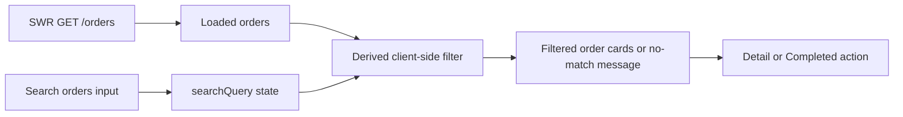

# Design Document: Order Search

## Current architecture impact

The feature is contained in the existing protected ListOrder page. `ListOrder.tsx` already uses SWR to retrieve the initial page of orders and renders cards from `data?.data || []`. No routing, service, API contract, persistence, or authentication change is needed.

The feature adds a `searchQuery` string state to `ListOrder`. A derived `filteredOrders` array is calculated from `orders` and `searchQuery`; it is not stored separately, avoiding stale duplicate state. The existing `Input` primitive currently does not accept `value` or `onChange`, so this feature requires the minimal backward-compatible extension of that primitive.

## Component changes

### `src/components/ui/Input/Input.tsx`

- Add optional `value?: string` and `onChange?: ChangeEventHandler<HTMLInputElement>` props.
- Forward both props to the native `<input>` only when provided.
- Preserve all existing uncontrolled usages and styling.

### `src/components/pages/ListOrder/ListOrder.tsx`

- Add `const [searchQuery, setSearchQuery] = useState("")`.
- Render `Input` between the page header and card list with label `Search orders` and the specified placeholder.
- Derive `normalizedQuery = searchQuery.trim().toLowerCase()`.
- Derive `filteredOrders` by retaining an order when one of `id`, `customer_name`, `table_number`, or `status`, converted to a lowercase string, includes `normalizedQuery`.
- Render `filteredOrders` in place of `orders` while preserving the existing Detail and Completed handlers.
- Render the original empty message only when `orders.length === 0`; render the no-match message only when `orders.length > 0 && filteredOrders.length === 0`.

### `src/components/pages/ListOrder/ListOrder.module.css`

- Add a scoped wrapper class for the search control.
- Ensure the wrapper uses the project spacing tokens and stays within the available width.
- At `max-width: 600px`, allow the control to occupy the full container width.

## Data flow

`searchQuery` never changes the SWR key, so typing cannot trigger a network request. Completing an order still calls `updateOrder()` and `mutate()`; the refetched Loaded_Orders are automatically filtered against the unchanged query.

## UI layout specification

- The search control appears inside the ListOrder page container after the header and before the card grid.
- It has a clear `Search orders` label and a placeholder describing searchable fields.
- Existing cards, badges, action buttons, skeleton, and empty state retain their current layout and visual design.
- A no-match message occupies the full card-grid width, matching the existing empty-state placement.

## Styling and responsive behavior

- Use CSS Modules exclusively in `ListOrder.module.css`.
- Use existing CSS custom properties for spacing, colors, and typography; do not introduce literal design values when a token exists.
- The search wrapper must be fluid (`width: 100%` with an appropriate maximum width) and fit the page padding on screens at or below 600px.

## Technical constraints

- Filter only the orders included in the existing request (`page=1&pageSize=10`). It is not a global server-side search.
- Do not add dependencies, a new route, Context, Redux, or a new service method.
- Keep `IOrder` unchanged.
- Preserve lazy-loaded routes, SWR loading behavior, and ProtectedRoute authorization.

## Verification strategy

- Unit-test the rendered ListOrder behavior with mocked order data: empty query, case-insensitive matches, table-number matches, and no-match feedback.
- Verify loading state remains a skeleton with the mocked request unresolved.
- Run `npm run build` and the relevant Vitest tests after implementation.
