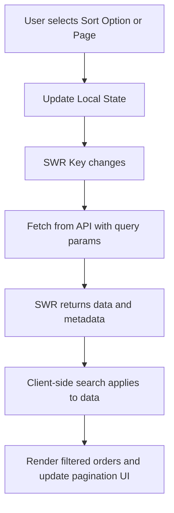

# Design Document: Order Sorting and Pagination

## 1. Current architecture impact

The feature extends the existing SWR data fetching mechanism in `ListOrder.tsx`. We will introduce local React state for `page` and `sortOption`. The SWR key will be updated dynamically to include these parameters (e.g., `/orders?page=${page}&pageSize=10&sortBy=${sortBy}&sortOrder=${sortOrder}`). The existing `metadata` from the API response will be utilized to determine `totalPages`.

## 2. Component changes

### `src/components/pages/ListOrder/ListOrder.tsx`
- Add state: `const [page, setPage] = useState(1);`
- Add state: `const [sortOption, setSortOption] = useState("newest");`
- Map `sortOption` to actual `sortBy` and `sortOrder` values before passing to SWR.
- Extract `data?.metadata?.totalPages` and `data?.metadata?.page`.
- Render a `<Select>` for sorting next to or above the search `<Input>`.
- Render pagination buttons (using `<Button>`) at the bottom of the order list.
- Handle edge cases like empty states appropriately.

## 3. File structure changes

No new files are necessary outside of the specs. Modifications are strictly within `ListOrder.tsx` and `ListOrder.module.css`.

## 4. Data flow

## 5. UI layout specification

- **Sorting Control**: Placed in the same section as the search input (`.search` wrapper). They can be arranged in a flex row (e.g., `display: flex; gap: 16px;`) so they sit side-by-side on desktop.
- **Pagination Controls**: Placed below the order list grid (`.list`). It should be a centered flex container with the layout: `[< Previous]  Page X of Y  [Next >]`.

## 6. Styling decisions

- Use existing CSS Modules (`ListOrder.module.css`).
- Introduce a `.controls` wrapper to hold both the search input and sort select.
- Introduce a `.pagination` wrapper for the bottom controls, using `var(--spacing-md)` for gaps and `var(--color-text-primary)` for text.

## 7. Responsive behavior

- At `max-width: 600px`, the `.controls` wrapper (Search + Sort) should switch from `flex-direction: row` to `flex-direction: column` so they stack vertically and occupy 100% width.
- Pagination buttons should remain usable and legible on small screens.

## 8. Technical constraints

- Must not introduce global state (Redux, Context).
- Relies on the backend API properly accepting `sortBy`, `sortOrder`, `page`, and returning `metadata`.
- Search remains client-side only (filtering the 10 items currently loaded).
