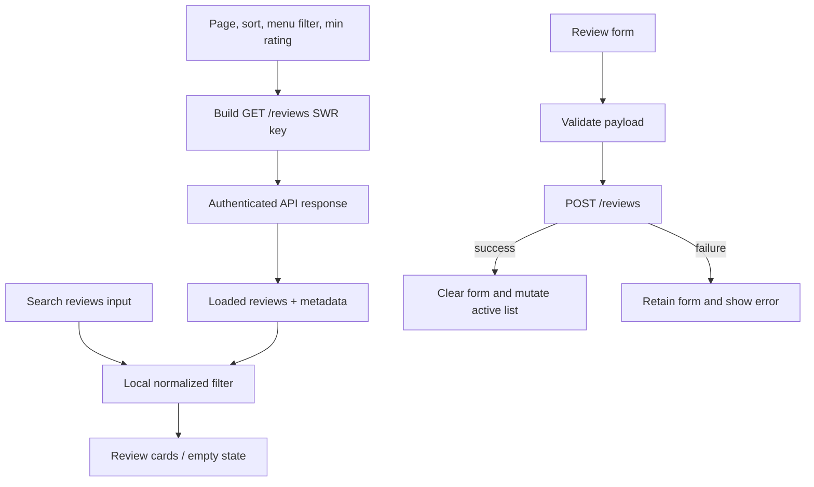

# Design Document: Reviews Management

## Current architecture impact

Reviews Management is a new protected page following the established ListOrder pattern: local React state drives an SWR key, `fetcher` performs authenticated GET requests, and a service function performs POST mutations. It adds no global state or dependency.

The feature requires a `reviews.service.ts` API layer and `review.ts` data types. `Review` list data is server-paginated/sorted/filtered; free-text search remains local to the loaded page. Existing `getMenus()` supplies the selector options needed to create or filter by menu item.

## File structure changes

```
src/
├── components/pages/Review/
│   ├── index.tsx
│   ├── Review.tsx
│   └── Review.module.css
├── services/reviews.service.ts
└── types/review.ts
```

Modified existing files:

- `src/routes/Route.tsx` — lazy-load and protect `/reviews`.
- `src/components/pages/ListOrder/ListOrder.tsx` — add Reviews navigation action.

## Data models and API contract

```ts
interface IReview {
  id: string;
  menu_item_id: string;
  reviewer_name: string;
  rating: number;
  comment: string;
  created_at: string;
}

interface IReviewListResponse {
  data: IReview[];
  metadata: {
    total: number;
    page: number;
    pageSize: number;
    totalPages: number;
  };
}

interface ICreateReviewPayload {
  menuItemId: string;
  reviewerName: string;
  rating: number;
  comment: string;
}

interface IReviewQuery {
  page: number;
  pageSize: number;
  menuItemId?: string;
  minRating?: number;
  sortBy: "created_at" | "rating";
  sortOrder: "asc" | "desc";
}
```

`getReviews(query)` SHALL build `${environment.API_URL}/reviews` with defined query values and use `fetcher` through SWR. `createReview(payload)` SHALL POST to the same endpoint with a Bearer token, matching existing write-service conventions.

## Component design

### Review_Page state

```ts
const [page, setPage] = useState(1);
const [searchQuery, setSearchQuery] = useState("");
const [sortOption, setSortOption] = useState("newest");
const [menuItemId, setMenuItemId] = useState("");
const [minRating, setMinRating] = useState("");
const [reviewerName, setReviewerName] = useState("");
const [rating, setRating] = useState("");
const [comment, setComment] = useState("");
const [submitError, setSubmitError] = useState<string | null>(null);
const [submitSuccess, setSubmitSuccess] = useState<string | null>(null);
const [isSubmitting, setIsSubmitting] = useState(false);
```

- A pure mapping turns `sortOption` into `sortBy` and `sortOrder`.
- `reviewQuery` is serialized into a stable SWR key, omitting empty `menuItemId` and `minRating` values.
- `filteredReviews` is derived from the loaded API page and normalized `searchQuery`; it must not become independent React state.
- Changing sort, menu filter, or minimum rating sets `page` to 1. Changing search does not request the API.
- POST success clears the form and invokes `mutate()` for the active reviews key.

## Data flow



## UI layout and styling

- Header: `Reviews` title and `Back to Orders` action.
- Review form: menu selector, reviewer input, rating selector, comment field, submit feedback, and submit button.
- Controls row: Search reviews, menu filter, minimum rating, and sort selector.
- List: review cards with reviewer, rating, comment, date formatted using `Intl.DateTimeFormat("id-ID")`, and menu-item ID.
- Footer: pagination controls.

Use a dedicated CSS Module with existing tokens and glass-card patterns. At 768px and below, form/control grids become one column, cards stay readable, and pagination wraps without overflow.

## Error handling and technical constraints

- GET failures use the specified page-level message; POST failures preserve all form state.
- A non-OK response used by SWR must throw through the existing `fetcher`; write responses should be handled consistently by the service.
- `rating` is converted from select text to number only after validation and before POST.
- The menu selector may show only menu items available from the existing menu endpoint; no additional API endpoint is introduced.
- API pagination limits: default page 1, default `pageSize` 10, and max 50. This UI uses `pageSize=10`.

## Verification strategy

- Unit tests mock SWR/API responses to cover initial GET key, review cards, empty/loading/error states, local search, server sort/filter query changes, pagination button states, form validation, POST success, and POST failure.
- Run `npm run build` and the focused review test suite after implementation.
